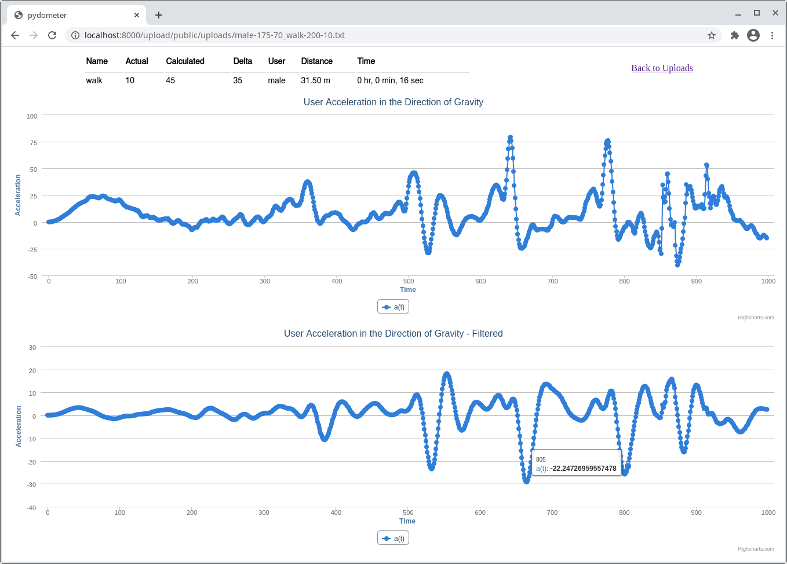

 <h1>pydometer</h1>

I'm porting [this app made in Ruby](https://github.com/aosabook/500lines/tree/master/pedometer) to Python, just as an exercise to practise with [Flask](https://flask.palletsprojects.com) and [classes](https://docs.python.org/3/tutorial/classes.html).

The original code belongs to ["500 Lines or Less"](https://aosabook.org/en/index.html#500lines), book distributed under the [Creative Commons Attribution license](http://creativecommons.org/licenses/by/3.0/). This project is fully explained in the chapter ["A Pedometer in the Real World"](https://aosabook.org/en/500L/a-pedometer-in-the-real-world.html) (Copyright (c) [Dessy Daskalov](https://twitter.com/dess_e)). It's worth reading.

